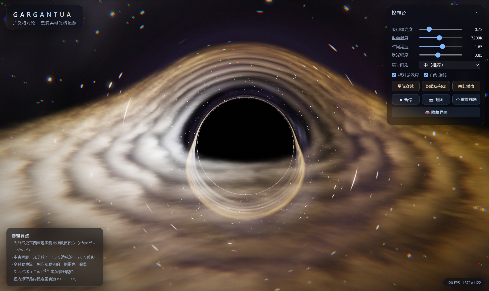
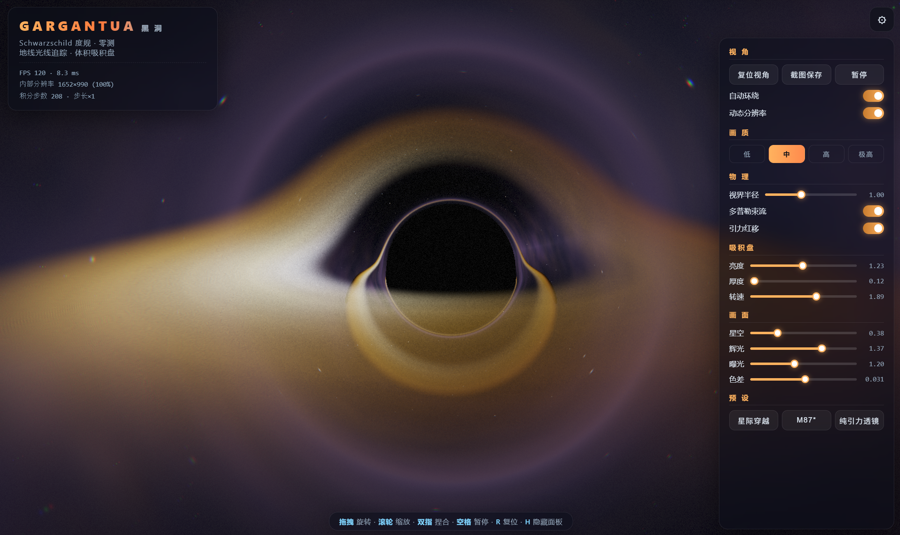
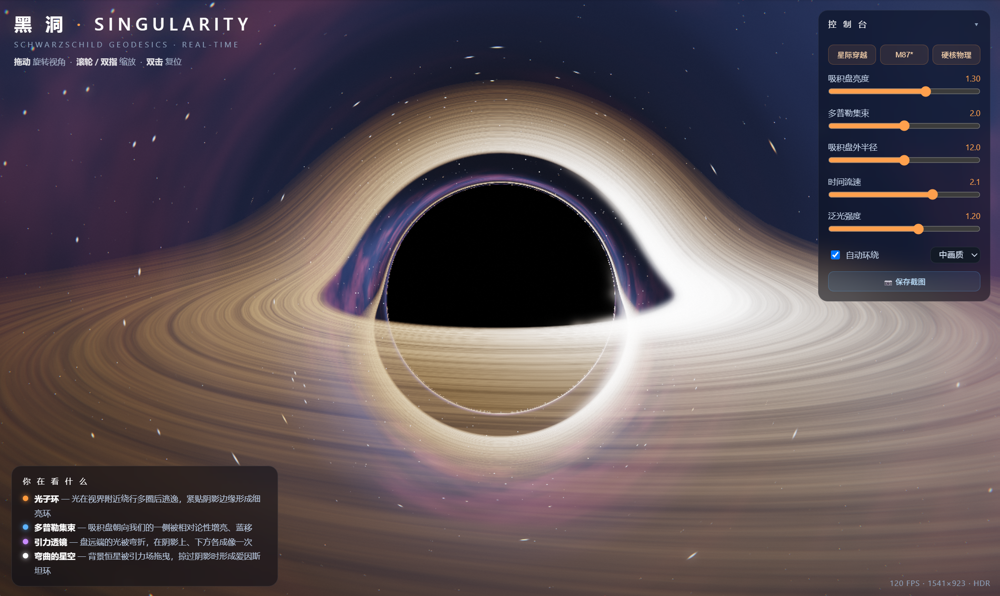

AI 横评看多了，容易得出「X 模型比 Y 模型强」的结论。但我最近更好奇另一个变量：**壳**。

同一个模型，装进不同的 harness（agent 应用）里，给它一样的提示词，产出会差多少？差在哪？为了回答这个问题，我找了个晚上，把 **GLM-5.3-FLASH** 分别装进三个 harness——**ChatGPT 桌面版、Claude Code、ZCode**——跑了两道题，全程记录耗时，产物留档对比。

结论先放这里：**模型决定下限，harness 决定上限**。三个壳的产出都能打，但性格迥异。所有产物做成了[在线 demo](https://yj1438.github.io/demos/)，文末可试玩。

## 1. 实验设计

控制变量，先交代清楚：

- **模型**：全部为 GLM-5.3-FLASH，同一时段完成（harness 版本号未逐一记录，截至 2026-09）
- **harness**：ChatGPT 桌面版 / Claude Code / ZCode
- **计时口径**：从提交指令到最终交付的完整任务时间
- **环境**：同一台 Windows 机器，同一个晚上连续完成

两道题都是社区经典或接近经典的题型。第一道：

> Generate an SVG of a pelican riding a bicycle
>
> 并且可以动起来

第二道：

> 一个 HTML 页面。使用 web 技术写一个黑洞演示，要 fancy，可以使用 webgl 或 web gpu 等最新技术实现。单页 HTML 即可，fancy 的同时也要尽可能真实，可以添加简单的交互。

总耗时一览（详细分析见下文）：

| 任务 | ChatGPT 桌面版 | Claude Code | ZCode |
| --- | --- | --- | --- |
| 鹈鹕骑车（动画 SVG） | **7m30s** | 11m20s | 28m0s |
| H5 黑洞（WebGL 单文件） | **14m3s** | 21m21s | 25m49s |

两道题 ZCode 都是最慢的。先别急着下结论，看产物。

## 2. 第一题：鹈鹕骑车

三只鹈鹕都是**会动的**（下面就是原图，不是截图）：

<div style="display:grid;grid-template-columns:repeat(3,1fr);gap:10px;margin:1.5rem 0">
  <figure style="margin:0">
    
    <figcaption style="text-align:center;font-size:.85rem;opacity:.7;margin-top:.4rem">ChatGPT 桌面版 · 7m30s</figcaption>
  </figure>
  <figure style="margin:0">
    
    <figcaption style="text-align:center;font-size:.85rem;opacity:.7;margin-top:.4rem">Claude Code · 11m20s</figcaption>
  </figure>
  <figure style="margin:0">
    
    <figcaption style="text-align:center;font-size:.85rem;opacity:.7;margin-top:.4rem">ZCode · 28m0s</figcaption>
  </figure>
</div>

单独看都觉得「还不错」，并排看差异就出来了：

| | ChatGPT 桌面版 | Claude Code | ZCode |
| --- | --- | --- | --- |
| 体积 | 10.0 KB | 10.4 KB | 14.2 KB |
| 动画手法 | 17 处 SMIL：车轮辐条旋转、地面滚动、云朵漂移 | 腿部用**路径形变**（`d` 插值）蹬踏板，速度线用 stroke-dashoffset，另配 CSS keyframes | 路径 + 点集双重形变，**4.2s 周期眨眼**，太阳 60s 自转，全部用贝塞尔缓动 |
| 无障碍 | 无 | 仅 `<title>` | **`aria-labelledby` + `<title>` + `<desc>`** |

最有意思的是 ZCode 的过程文件：目录里留了两版——开工约 10 分钟时它先交付了一版**带完整无障碍标注的静态图**，然后继续打磨，到第 28 分钟升级成动画版。也就是说它把这道题当成了「先给可用版本，再迭代到满意」，而不是一次性交差。

无障碍标注不是运气，两版都保留了：

```svg
<svg ... role="img" aria-labelledby="t d">
  <title id="t">Pelican riding a bicycle (animated)</title>
  <desc id="d">An animated flat-style illustration of a cheerful
    pelican wearing a red helmet, pedaling an orange bicycle...</desc>
```

## 3. 第二题：H5 黑洞

这道题三个壳的完成度都出乎我意料——都是**真材实料的 WebGL2 片元着色器光线追踪**，史瓦西度规下的测地线积分，光子环、多普勒集束（朝向观察者一侧更亮更蓝）、引力透镜（盘远端的光在阴影上下方各成像一次）这些相对论效应全都有，全部单文件零依赖，实测满 120 FPS。

**ChatGPT 桌面版 · 14m3s**，450 行，23 个 uniform。界面最克制，该有的都有：吸积盘亮度、盘面温度（开尔文）、时间流速、三种预设，加载文案是「正在弯曲时空 ...」：



**Claude Code · 21m21s**，515 行，28 个 uniform。多了两个很有工程意识的细节：**ACES 色调映射**和**动态分辨率**（根据帧耗时自动调渲染精度）。加载动画本身画成了一个带光子环的小黑洞：



**ZCode · 25m49s**，703 行，35 个 uniform，三者中最重。除了完整的物理参数面板，它做了一个另外两家都没做的事：在左下角放了一个「你在看什么」的科普面板，把光子环、多普勒集束、引力透镜、爱因斯坦环一一标注出来——顺手把「黑洞演示」升级成了「黑洞科普」：



还有一个三家不约而同的彩蛋：都做了主题化的加载文案——「正在弯曲时空 ...」「正在编译着色器 ...」「初始化引擎 ...」。没人要求这个，是 harness 们自己的审美。

**在线试玩**（都在我的博客上，零依赖直开）：

- [ChatGPT 桌面版 · 黑洞](https://yj1438.github.io/demos/blackhole-gpt.html) / [鹈鹕](https://yj1438.github.io/demos/pelican-gpt.svg)
- [Claude Code · 黑洞](https://yj1438.github.io/demos/blackhole-cc.html) / [鹈鹕](https://yj1438.github.io/demos/pelican-cc.svg)
- [ZCode · 黑洞](https://yj1438.github.io/demos/blackhole-zai.html) / [鹈鹕](https://yj1438.github.io/demos/pelican-zai.svg)
- [全部产物索引页](https://yj1438.github.io/demos/)

## 4. 同一个大脑，三种性格

这次实验最触动我的不是「谁画得好看」，而是：**模型明明是同一个，产出性格却截然不同**。

黑洞题的完成度证明了**下限是模型给的**——三个壳都能交付能打的产物，说明 GLM-5.3-FLASH 的图形学和相对论功底扎实，谁来用都不虚。

而差异是 harness 给的，我总结了三条：

1. **迭代意愿**。ZCode 是唯一留下「先交付、再打磨」痕迹的（静态版 → 动画版）。慢的 28 分钟里，有 18 分钟是在自主升级。
2. **工程素养的坚持**。三道题里只有一个产物带无障碍标注，且两版都保留——不是提示词要求的，是 harness 自己的习惯。
3. **对「读者」的照顾**。Claude Code 给渲染加了动态分辨率（照顾帧率），ZCode 给画面加了科普面板（照顾观众）。前者是性能思维，后者是产品思维。

速度上 ChatGPT 桌面版两轮都是最快，如果只是出个草图、验证个想法，它最省时间。

## 5. 结论：综合最适合的是 ZCode

如果只看速度，ChatGPT 桌面版赢；如果看单点工程技巧，Claude Code 的动态分辨率很惊艳。但**综合产物质量、细节完成度、自主迭代和无障碍习惯，我投 ZCode**——慢一点，但交付的东西拿得出手，也最让人放心。

这也回答了开头的问题：选 agent 应用的时候，别只盯着模型跑分。同一个模型，换个壳，你得到的是三种完全不同的协作者。**模型决定下限，harness 决定上限**——选个性格对味的壳，比等下一次模型更新更立竿见影。
