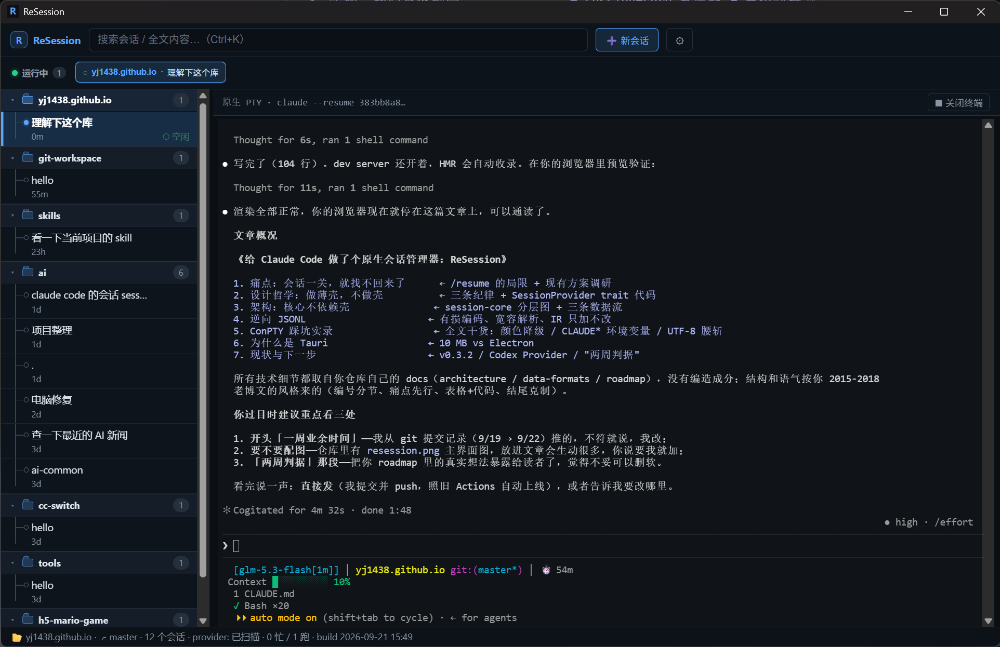

博客重启后的第一篇正经文章，交付物是最近写的一个小工具：[ReSession](https://github.com/yj1438/resession) —— 一个轻量的、**原生**的 Claude Code 会话管理器。一周业余时间，Rust 约 2000 行 + TS 约 1300 行，已经到了我自己每天在用的程度。



## 1. 痛点：会话一关，就找不回来了

Claude Code 用得越深，一个需求就越强烈：**找回以前的会话**。

`/resume` 只显示当前项目的会话。上周在 A 项目里调好的一个方案，今天在 B 项目想引用它的上下文，`/resume` 里根本没有它。对话内容其实都好好躺在本地 `~/.claude/projects/*.jsonl` 里，缺的只是一个好用的入口。

调研（2026-09）了一圈现有方案：

* **CLI 工具**（chronologos、cc-sessions）：解决了"找到"，但终端形态的浏览与回放体验有限；
* **GUI 项目**（opcode、Crystal、Vibe Kanban）：要么在会话外面包一层协议代理，要么是重型任务编排平台。

我想要的其实很简单：**列表 → 搜索 → 回放确认 → 一键回到原生 CLI**。没有现成的，就自己写一个。

## 2. 设计哲学：做薄壳，不做壳

三条纪律，写进了设计文档，也写进了代码 review 习惯：

**① 原生会话是唯一事实源。** 只读 `~/.claude/projects/*.jsonl`，不建自己的会话存储；恢复就是在内嵌真终端里跑 `claude --resume <id>`，Claude Code 的 TUI 原样运行。ReSession 不解析、不记录、不干预 PTY 内容——没有协议代理，没有重新渲染的聊天 UI。

**② 薄壳，只用现成轮子。** Tauri 2（约 10 MB 便携 exe）、React、xterm.js、portable-pty（WezTerm 同款）。所有"有意思"的复杂度都应该在解析层和架构纪律上，而不是重造终端。

**③ Provider 纪律。** 所有 Claude 特定逻辑收口在一个 trait 后面，UI 层和 Tauri 命令层只认这个接口：

```rust
pub trait SessionProvider: Send + Sync {
    fn name(&self) -> &'static str;                       // "claude" / "codex" / ...
    fn scan(&self) -> Result<Vec<SessionMeta>>;           // 发现全部会话
    fn load_transcript(&self, meta: &SessionMeta)
        -> Result<Vec<Event>>;                            // 原始 JSONL → IR
    fn resume_command(&self, meta: &SessionMeta)
        -> Result<ResumeSpec>;                            // 二进制查找 + 命令模板
}
```

以后接入 Codex = 新增一个 adapter 目录 + 注册一行，UI 不动。

## 3. 架构：核心不依赖壳

```
WebView (React + TS)            Rust 进程
┌──────────────────┐  invoke  ┌──────────────────┐
│ Sidebar 会话列表  │ ───────► │ session-core     │ ← 纯逻辑 crate
│ TranscriptPane   │          │ (serde + std)    │   不依赖 Tauri
│ TerminalPane     │  PTY 流  │                  │
│  └─ xterm.js ◄──────────── │ src-tauri        │ ← 壳：PTY / 事件桥
└──────────────────┘          └──────────────────┘
```

核心逻辑放在独立的 `crates/session-core`，依赖只有 serde 和 std，**不依赖 Tauri**，可以独立测试。壳层（`src-tauri`）只干三件事：invoke 命令、PTY 生命周期、事件推送。

三条数据流：

* **扫描**：流式逐行读元数据（首条 user 消息、时间戳、消息数），遇到消息体整行跳过——几十 MB 的大会话文件也不怕；
* **回放**：JSONL 宽容解析 → 统一 IR → 前端渲染（markdown、代码高亮、工具调用折叠）；
* **恢复**：PTY 以会话 id 为键**常驻后端**，切换会话只是"断开观看"，切回时用 512KB 滚动快照重新附着——天然支持多会话并行跑，侧栏绿点提示忙闲。

## 4. 逆向 JSONL：对私有格式要保持宽容

Claude Code 的会话格式没有官方文档，我边写边观测记录（见仓库 `docs/data-formats.md`）。几个关键发现：

* 项目目录是**有损编码**：`D:\code\my-app` → `D--code-my-app`，`:` `\` `/` 全变 `-`，不可逆。真实 cwd 必须从文件内容每行的 `cwd` 字段取，目录名只能做展示兜底；
* `message.content` 可能是 string，也可能是 block 数组；`queue-operation` 行回放时应忽略；`isSidechain: true` 的子 agent 会话要过滤；fork 出的会话是独立文件，靠 `forkedFrom.sessionId` 指回父会话。

格式是私有的，随时会变。对策就一条：**宽容解析**——单行失败不炸整个文件（`lines().filter_map`），未知行类型忽略，未知 block 降级成原始 JSON 折叠块。中间表示（IR）的演化规则也只有一条：**只加不改**。

## 5. ConPTY 踩坑实录

Windows 上用 ConPTY 给内嵌终端当底座，踩了三个值得记录的坑：

**坑一：TUI 黑白无色。** claude（Node 程序）在 ConPTY 下的终端能力探测不可靠，颜色直接降级。解法是 spawn 时注入环境变量：`FORCE_COLOR=3`（chalk 层强制真彩）+ `TERM=xterm-256color` + `COLORTERM=truecolor`。

**坑二：恢复的会话不写转录。** 这个最阴。如果宿主进程环境里带着 `CLAUDE*` 环境变量，PTY 子进程会继承它们，claude 便把自己识别为 child session，**静默关闭转录写入**——功能一切正常，就是会话没保存，等你下次 `/resume` 才发现空了。解法：spawn 前 `env_clear` + 白名单重灌，剥离全部 `CLAUDE*` 以及 `CI`/`NO_COLOR`。

**坑三：中文跨块乱码。** PTY 输出按块到达，逐块做 lossy UTF-8 解码会把多字节字符腰斩。解法：输出改字节级传输（`Vec<u8>` → `Uint8Array`），把 UTF-8 状态机交给 xterm 自己处理。

三个坑共同的教训：**别替子进程做决定，把它本来就认识的信号原样喂给它。**

## 6. 为什么是 Tauri

一个"查会话"的频率型小工具，体量就是正义：Tauri 2 构建产物约 **10 MB 单文件 exe**，静态链接 CRT，运行时只依赖系统自带的 WebView2。对比 Electron 起步 150 MB+，心理负担完全不同。卸载 = 删文件，ReSession 只写自己的一个 `settings.json`，Claude 的数据一个字节不动。

## 7. 现状与下一步

当前 v0.3.2，**Windows 10/11 日常使用品质**，Releases 下载 `resession.exe` 双击即用；macOS 的 CI 产物（.app）刚跑通，待真机验证。

下一步是 Codex Provider——"跨 Agent"是整个架构的立论基础，得用一个真实适配器证明它不是空话。

* 仓库：[yj1438/resession](https://github.com/yj1438/resession)
* 中文文档：[docs/](https://github.com/yj1438/resession/tree/main/docs)（设计 / 架构 / 数据格式 / 构建 / 路线图）
* 下载：[Releases](https://github.com/yj1438/resession/releases)
